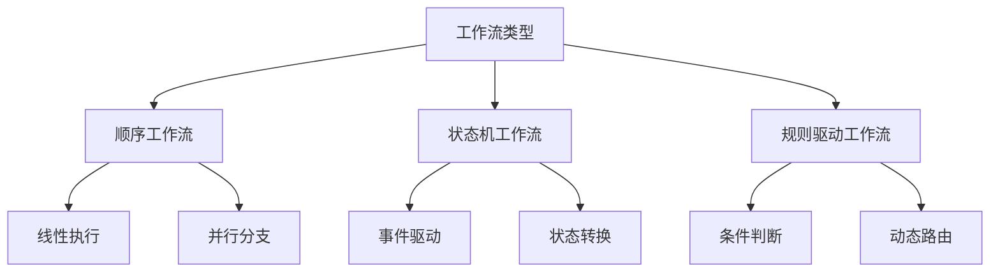

# Workflow 工作流深入解析

## 目录
1. [工作流核心概念](#工作流核心概念)
2. [工作流引擎原理](#工作流引擎原理)
3. [状态机与工作流](#状态机与工作流)
4. [分布式工作流](#分布式工作流)
5. [工作流设计模式](#工作流设计模式)
6. [性能优化策略](#性能优化策略)
7. [故障恢复机制](#故障恢复机制)

---

## 工作流核心概念

### 1. 工作流定义

工作流（Workflow）是对**业务流程**的形式化描述，由一系列**活动（Activity）**和**转移（Transition）**组成。

```
工作流 = {活动集合, 转移规则, 开始节点, 结束节点}
```

### 2. 关键术语

| 术语 | 英文 | 说明 |
|-----|------|------|
| 活动 | Activity/Task | 工作流中的基本执行单元 |
| 转移 | Transition | 活动之间的流向控制 |
| 实例 | Instance | 工作流的一次具体执行 |
| 变量 | Variable | 活动间传递的数据 |
| 网关 | Gateway | 控制流程分支与合并 |

### 3. 工作流分类



---

## 工作流引擎原理

### 1. 架构组件

```
┌─────────────────────────────────────────┐
│           工作流引擎架构                  │
├─────────────────────────────────────────┤
│  API Layer    │  REST API, gRPC, SDK   │
├───────────────┼─────────────────────────┤
│  Core Engine  │  流程解析, 状态管理, 调度 │
├───────────────┼─────────────────────────┤
│  Executor     │  任务执行器, 插件系统      │
├───────────────┼─────────────────────────┤
│  Persistence  │  状态存储, 历史记录        │
├───────────────┼─────────────────────────┤
│  Event Bus    │  消息队列, 事件分发        │
└─────────────────────────────────────────┘
```

### 2. 状态机实现

```python
from enum import Enum, auto
from dataclasses import dataclass
from typing import Dict, List, Callable

class TaskState(Enum):
    """任务状态枚举"""
    PENDING = auto()      # 等待执行
    RUNNING = auto()      # 运行中
    SUCCESS = auto()      # 成功完成
    FAILED = auto()       # 执行失败
    RETRYING = auto()     # 重试中
    CANCELLED = auto()    # 已取消

@dataclass
class Task:
    """工作流任务"""
    id: str
    name: str
    state: TaskState = TaskState.PENDING
    retries: int = 0
    max_retries: int = 3
    
    # 状态转换函数映射
    _transitions: Dict[TaskState, List[TaskState]] = None
    
    def __post_init__(self):
        self._transitions = {
            TaskState.PENDING: [TaskState.RUNNING, TaskState.CANCELLED],
            TaskState.RUNNING: [TaskState.SUCCESS, TaskState.FAILED, TaskState.RETRYING],
            TaskState.RETRYING: [TaskState.RUNNING, TaskState.FAILED],
            TaskState.FAILED: [TaskState.RETRYING] if self.retries < self.max_retries else [],
            TaskState.SUCCESS: [],
            TaskState.CANCELLED: []
        }
    
    def can_transition_to(self, new_state: TaskState) -> bool:
        """检查状态转换是否合法"""
        return new_state in self._transitions.get(self.state, [])
    
    def transition(self, new_state: TaskState) -> bool:
        """执行状态转换"""
        if self.can_transition_to(new_state):
            old_state = self.state
            self.state = new_state
            
            if new_state == TaskState.RETRYING:
                self.retries += 1
            
            print(f"任务 {self.name}: {old_state.name} -> {new_state.name}")
            return True
        else:
            raise ValueError(
                f"非法状态转换: {self.state.name} -> {new_state.name}"
            )

# 使用示例
task = Task(id="001", name="数据预处理")
task.transition(TaskState.RUNNING)   # PENDING -> RUNNING
task.transition(TaskState.SUCCESS)   # RUNNING -> SUCCESS
```

### 3. 调度器实现

```python
import heapq
import asyncio
from datetime import datetime, timedelta
from typing import Optional

class WorkflowScheduler:
    """工作流调度器"""
    
    def __init__(self):
        self.task_queue = []  # 优先队列
        self.running_tasks = {}
        self.task_counter = 0
    
    def schedule_task(
        self,
        task_func: Callable,
        priority: int = 0,
        delay: Optional[timedelta] = None
    ) -> str:
        """调度任务"""
        self.task_counter += 1
        task_id = f"task_{self.task_counter}"
        
        # 计算执行时间
        execute_at = datetime.now()
        if delay:
            execute_at += delay
        
        # 加入优先队列 (优先级, 执行时间, 任务ID, 任务函数)
        heapq.heappush(
            self.task_queue,
            (priority, execute_at, task_id, task_func)
        )
        
        return task_id
    
    async def run(self):
        """调度器主循环"""
        while True:
            now = datetime.now()
            
            # 检查是否有到期任务
            while self.task_queue and self.task_queue[0][1] <= now:
                _, _, task_id, task_func = heapq.heappop(self.task_queue)
                
                # 异步执行任务
                asyncio.create_task(self._execute_task(task_id, task_func))
            
            await asyncio.sleep(1)  # 每秒检查一次
    
    async def _execute_task(self, task_id: str, task_func: Callable):
        """执行任务"""
        try:
            self.running_tasks[task_id] = datetime.now()
            result = await task_func()
            print(f"任务 {task_id} 完成: {result}")
        except Exception as e:
            print(f"任务 {task_id} 失败: {e}")
        finally:
            del self.running_tasks[task_id]

# 使用示例
async def sample_task():
    await asyncio.sleep(2)
    return "处理完成"

scheduler = WorkflowScheduler()
scheduler.schedule_task(sample_task, priority=1)
scheduler.schedule_task(sample_task, priority=0, delay=timedelta(minutes=5))

# asyncio.run(scheduler.run())
```

---

## 状态机与工作流

### 1. Petri 网模型

Petri 网是描述工作流的数学工具，由**库所（Place）**、**变迁（Transition）**和**弧（Arc）**组成。

```python
class PetriNet:
    """Petri 网实现"""
    
    def __init__(self):
        self.places = {}        # 库所: 标记数量
        self.transitions = {}   # 变迁: {输入库所: 权重, 输出库所: 权重}
        self.marking = {}       # 当前标记
    
    def add_place(self, name: str, initial_tokens: int = 0):
        """添加库所"""
        self.places[name] = initial_tokens
        self.marking[name] = initial_tokens
    
    def add_transition(
        self,
        name: str,
        inputs: Dict[str, int],
        outputs: Dict[str, int]
    ):
        """添加变迁"""
        self.transitions[name] = {
            'inputs': inputs,
            'outputs': outputs
        }
    
    def is_enabled(self, transition_name: str) -> bool:
        """检查变迁是否可触发"""
        transition = self.transitions[transition_name]
        
        for place, weight in transition['inputs'].items():
            if self.marking.get(place, 0) < weight:
                return False
        return True
    
    def fire(self, transition_name: str) -> bool:
        """触发变迁"""
        if not self.is_enabled(transition_name):
            return False
        
        transition = self.transitions[transition_name]
        
        # 消耗输入标记
        for place, weight in transition['inputs'].items():
            self.marking[place] -= weight
        
        # 产生输出标记
        for place, weight in transition['outputs'].items():
            self.marking[place] = self.marking.get(place, 0) + weight
        
        print(f"变迁 {transition_name} 触发")
        print(f"当前标记: {self.marking}")
        return True

# 工作流示例: 审批流程
net = PetriNet()
net.add_place("开始", 1)
net.add_place("主管审批")
net.add_place("经理审批")
net.add_place("结束")

net.add_transition(
    "提交申请",
    {"开始": 1},
    {"主管审批": 1}
)

net.add_transition(
    "主管通过",
    {"主管审批": 1},
    {"经理审批": 1}
)

net.add_transition(
    "经理通过",
    {"经理审批": 1},
    {"结束": 1}
)

# 执行流程
net.fire("提交申请")
net.fire("主管通过")
net.fire("经理通过")
```

### 2. BPMN 2.0 规范

业务流程模型和标记法（BPMN）是工作流的标准表示方法。

```python
@dataclass
class BPMNNode:
    """BPMN 节点基类"""
    id: str
    name: str
    node_type: str  # 'task', 'gateway', 'event'
    incoming: List[str] = None
    outgoing: List[str] = None

class BPMNParser:
    """BPMN 解析器"""
    
    def __init__(self):
        self.nodes: Dict[str, BPMNNode] = {}
        self.sequence_flows = []
    
    def parse_xml(self, xml_content: str):
        """解析 BPMN XML"""
        import xml.etree.ElementTree as ET
        
        root = ET.fromstring(xml_content)
        ns = {'bpmn': 'http://www.omg.org/spec/BPMN/20100524/MODEL'}
        
        # 解析任务
        for task in root.findall('.//bpmn:task', ns):
            node = BPMNNode(
                id=task.get('id'),
                name=task.get('name', ''),
                node_type='task'
            )
            self.nodes[node.id] = node
        
        # 解析网关
        for gateway in root.findall('.//bpmn:exclusiveGateway', ns):
            node = BPMNNode(
                id=gateway.get('id'),
                name=gateway.get('name', ''),
                node_type='gateway'
            )
            self.nodes[node.id] = node
        
        # 解析顺序流
        for flow in root.findall('.//bpmn:sequenceFlow', ns):
            self.sequence_flows.append({
                'id': flow.get('id'),
                'source': flow.get('sourceRef'),
                'target': flow.get('targetRef')
            })
        
        self._build_topology()
    
    def _build_topology(self):
        """构建拓扑关系"""
        for flow in self.sequence_flows:
            source = self.nodes.get(flow['source'])
            target = self.nodes.get(flow['target'])
            
            if source and target:
                if source.outgoing is None:
                    source.outgoing = []
                source.outgoing.append(flow['target'])
                
                if target.incoming is None:
                    target.incoming = []
                target.incoming.append(flow['source'])
    
    def validate(self) -> List[str]:
        """验证流程合法性"""
        errors = []
        
        # 检查孤立节点
        for node_id, node in self.nodes.items():
            if not node.incoming and not node.outgoing:
                errors.append(f"节点 {node_id} 是孤立的")
        
        # 检查死锁（没有出边的非结束节点）
        for node_id, node in self.nodes.items():
            if node.node_type != 'event' and not node.outgoing:
                errors.append(f"节点 {node_id} 可能导致死锁")
        
        return errors
```

---

## 分布式工作流

### 1. 分布式事务

```python
from typing import List, Tuple
import uuid

class Saga:
    """Saga 模式实现分布式事务"""
    
    def __init__(self):
        self.steps: List[Tuple[Callable, Callable]] = []  # (执行, 补偿)
        self.execution_log = []
        self.saga_id = str(uuid.uuid4())
    
    def add_step(self, action: Callable, compensation: Callable):
        """添加步骤"""
        self.steps.append((action, compensation))
        return self
    
    async def execute(self, context: dict) -> bool:
        """执行 Saga"""
        completed_steps = []
        
        try:
            for i, (action, _) in enumerate(self.steps):
                print(f"[Saga {self.saga_id}] 执行步骤 {i+1}/{len(self.steps)}")
                
                result = await action(context)
                completed_steps.append(i)
                self.execution_log.append({
                    'step': i,
                    'action': 'execute',
                    'result': result
                })
            
            print(f"[Saga {self.saga_id}] 执行成功")
            return True
            
        except Exception as e:
            print(f"[Saga {self.saga_id}] 步骤 {len(completed_steps)} 失败: {e}")
            # 执行补偿
            await self._compensate(completed_steps, context)
            return False
    
    async def _compensate(self, completed_steps: List[int], context: dict):
        """执行补偿操作"""
        for step_index in reversed(completed_steps):
            _, compensation = self.steps[step_index]
            try:
                await compensation(context)
                self.execution_log.append({
                    'step': step_index,
                    'action': 'compensate',
                    'result': 'success'
                })
            except Exception as e:
                # 补偿失败需要人工介入
                print(f"[Saga {self.saga_id}] 补偿步骤 {step_index} 失败: {e}")
                self.execution_log.append({
                    'step': step_index,
                    'action': 'compensate',
                    'result': 'failed',
                    'error': str(e)
                })

# 订单处理示例
async def reserve_inventory(ctx):
    print("预留库存")
    # 调用库存服务
    return {'inventory_reserved': True}

async def release_inventory(ctx):
    print("释放库存")
    # 补偿操作

async def process_payment(ctx):
    print("处理支付")
    # 调用支付服务
    if ctx.get('payment_fail'):
        raise Exception("支付失败")
    return {'payment_id': 'P123'}

async def refund_payment(ctx):
    print("退款")
    # 补偿操作

async def create_shipment(ctx):
    print("创建配送单")
    return {'shipment_id': 'S456'}

async def cancel_shipment(ctx):
    print("取消配送")
    # 补偿操作

# 构建 Saga
order_saga = Saga()
order_saga.add_step(reserve_inventory, release_inventory)
order_saga.add_step(process_payment, refund_payment)
order_saga.add_step(create_shipment, cancel_shipment)

# asyncio.run(order_saga.execute({'order_id': 'O789'}))
```

### 2. 事件溯源

```python
from datetime import datetime
from typing import List, Dict, Any
import json

class Event:
    """领域事件"""
    def __init__(
        self,
        event_type: str,
        aggregate_id: str,
        payload: Dict[str, Any]
    ):
        self.event_type = event_type
        self.aggregate_id = aggregate_id
        self.payload = payload
        self.timestamp = datetime.now()
        self.version = 0
    
    def to_dict(self) -> dict:
        return {
            'event_type': self.event_type,
            'aggregate_id': self.aggregate_id,
            'payload': self.payload,
            'timestamp': self.timestamp.isoformat(),
            'version': self.version
        }

class EventStore:
    """事件存储"""
    
    def __init__(self):
        self.events: Dict[str, List[Event]] = {}  # aggregate_id -> events
        self.projections: Dict[str, Dict] = {}    # 物化视图
    
    def append(self, event: Event):
        """追加事件"""
        if event.aggregate_id not in self.events:
            self.events[event.aggregate_id] = []
        
        event.version = len(self.events[event.aggregate_id]) + 1
        self.events[event.aggregate_id].append(event)
        
        # 更新投影
        self._update_projection(event)
    
    def get_events(self, aggregate_id: str) -> List[Event]:
        """获取聚合的所有事件"""
        return self.events.get(aggregate_id, [])
    
    def _update_projection(self, event: Event):
        """更新物化视图"""
        # 简化的投影更新逻辑
        if event.event_type == 'TaskStarted':
            self.projections[event.aggregate_id] = {
                'status': 'running',
                'started_at': event.timestamp
            }
        elif event.event_type == 'TaskCompleted':
            if event.aggregate_id in self.projections:
                self.projections[event.aggregate_id]['status'] = 'completed'
                self.projections[event.aggregate_id]['completed_at'] = event.timestamp
    
    def replay(self, aggregate_id: str) -> Dict:
        """重放事件重建状态"""
        events = self.get_events(aggregate_id)
        state = {}
        
        for event in events:
            # 应用事件到状态
            if event.event_type == 'TaskCreated':
                state.update(event.payload)
            elif event.event_type == 'TaskStarted':
                state['status'] = 'running'
            elif event.event_type == 'TaskCompleted':
                state['status'] = 'completed'
                state['result'] = event.payload.get('result')
        
        return state

# 使用示例
store = EventStore()

# 产生事件
store.append(Event('TaskCreated', 'task-001', {'name': '数据处理'}))
store.append(Event('TaskStarted', 'task-001', {'worker': 'node-1'}))
store.append(Event('TaskCompleted', 'task-001', {'result': 'success'}))

# 重放重建状态
current_state = store.replay('task-001')
print(f"当前状态: {current_state}")
```

---

## 工作流设计模式

### 1. 管道模式（Pipeline）

```python
from typing import TypeVar, Generic, List, Callable

T = TypeVar('T')

class PipelineStage(Generic[T]):
    """管道阶段"""
    
    def __init__(self, name: str, processor: Callable[[T], T]):
        self.name = name
        self.processor = processor
    
    def process(self, data: T) -> T:
        print(f"[{self.name}] 处理中...")
        return self.processor(data)

class Pipeline(Generic[T]):
    """数据处理管道"""
    
    def __init__(self):
        self.stages: List[PipelineStage[T]] = []
    
    def add_stage(self, stage: PipelineStage[T]):
        """添加阶段"""
        self.stages.append(stage)
        return self
    
    def execute(self, initial_data: T) -> T:
        """执行管道"""
        data = initial_data
        
        for stage in self.stages:
            try:
                data = stage.process(data)
            except Exception as e:
                print(f"[错误] 阶段 {stage.name} 失败: {e}")
                raise
        
        return data

# 机器学习数据管道
def load_data(config):
    """加载数据"""
    print("加载数据集...")
    return {'raw_data': '...', 'config': config}

def clean_data(data):
    """数据清洗"""
    print("清洗数据...")
    data['cleaned_data'] = '...'
    return data

def engineer_features(data):
    """特征工程"""
    print("构建特征...")
    data['features'] = '...'
    return data

def normalize(data):
    """归一化"""
    print("归一化处理...")
    data['normalized'] = True
    return data

# 构建管道
ml_pipeline = Pipeline()
ml_pipeline.add_stage(PipelineStage('数据加载', load_data))
ml_pipeline.add_stage(PipelineStage('数据清洗', clean_data))
ml_pipeline.add_stage(PipelineStage('特征工程', engineer_features))
ml_pipeline.add_stage(PipelineStage('归一化', normalize))

# 执行
# result = ml_pipeline.execute({'source': 'database'})
```

### 2. 分叉-合并模式（Fork-Join）

```python
import asyncio
from typing import List, Any

class ForkJoinExecutor:
    """分叉-合并执行器"""
    
    async def fork(self, tasks: List[callable]) -> List[Any]:
        """并行执行多个任务"""
        print(f"分叉: 启动 {len(tasks)} 个并行任务")
        
        # 创建所有任务
        coroutines = [task() for task in tasks]
        
        # 并发执行并收集结果
        results = await asyncio.gather(
            *coroutines,
            return_exceptions=True
        )
        
        return results
    
    async def join(self, results: List[Any]) -> Any:
        """合并结果"""
        print("合并: 整合所有任务结果")
        
        # 检查是否有异常
        errors = [r for r in results if isinstance(r, Exception)]
        if errors:
            raise Exception(f"部分任务失败: {errors}")
        
        # 合并逻辑
        merged = {
            'results': results,
            'count': len(results),
            'success': all(r is not None for r in results)
        }
        
        return merged

# 使用示例
async def fetch_user_data():
    await asyncio.sleep(1)
    return {'user': 'data'}

async def fetch_order_data():
    await asyncio.sleep(1.5)
    return {'order': 'data'}

async def fetch_inventory_data():
    await asyncio.sleep(0.5)
    return {'inventory': 'data'}

async def main():
    executor = ForkJoinExecutor()
    
    # 分叉: 并行获取数据
    tasks = [fetch_user_data, fetch_order_data, fetch_inventory_data]
    results = await executor.fork(tasks)
    
    # 合并: 整合报告
    report = await executor.join(results)
    return report

# asyncio.run(main())
```

### 3. 监控者模式（Monitor）

```python
import time
from dataclasses import dataclass
from collections import deque

@dataclass
class Metric:
    """指标数据"""
    timestamp: float
    task_id: str
    metric_name: str
    value: float

class WorkflowMonitor:
    """工作流监控器"""
    
    def __init__(self, max_history: int = 1000):
        self.metrics: deque = deque(maxlen=max_history)
        self.active_tasks = {}
        self.alerts = []
    
    def record(self, task_id: str, metric_name: str, value: float):
        """记录指标"""
        metric = Metric(time.time(), task_id, metric_name, value)
        self.metrics.append(metric)
        
        # 实时检查阈值
        self._check_thresholds(metric)
    
    def _check_thresholds(self, metric: Metric):
        """检查告警阈值"""
        thresholds = {
            'execution_time': 300,  # 5分钟
            'error_rate': 0.1,      # 10%
            'queue_depth': 100
        }
        
        limit = thresholds.get(metric.metric_name)
        if limit and metric.value > limit:
            self._trigger_alert(metric, limit)
    
    def _trigger_alert(self, metric: Metric, threshold: float):
        """触发告警"""
        alert = {
            'timestamp': metric.timestamp,
            'task': metric.task_id,
            'metric': metric.metric_name,
            'value': metric.value,
            'threshold': threshold,
            'severity': 'warning' if metric.value < threshold * 1.5 else 'critical'
        }
        self.alerts.append(alert)
        print(f"⚠️ 告警: {alert}")
    
    def get_statistics(self, task_id: str = None) -> dict:
        """获取统计信息"""
        metrics = [
            m for m in self.metrics 
            if task_id is None or m.task_id == task_id
        ]
        
        if not metrics:
            return {}
        
        values = [m.value for m in metrics]
        
        return {
            'count': len(values),
            'avg': sum(values) / len(values),
            'min': min(values),
            'max': max(values),
            'alerts_24h': len([
                a for a in self.alerts 
                if a['timestamp'] > time.time() - 86400
            ])
        }
    
    def generate_report(self) -> str:
        """生成监控报告"""
        stats = self.get_statistics()
        
        report = f"""
        === 工作流监控报告 ===
        总指标数: {stats.get('count', 0)}
        平均耗时: {stats.get('avg', 0):.2f}s
        最大耗时: {stats.get('max', 0):.2f}s
        24h告警: {stats.get('alerts_24h', 0)}
        
        活跃告警:
        """
        for alert in self.alerts[-5:]:
            report += f"\n  - {alert['metric']}: {alert['value']:.2f}"
        
        return report
```

---

## 性能优化策略

### 1. 连接池管理

```python
import queue
import threading

class ConnectionPool:
    """数据库连接池"""
    
    def __init__(self, factory, max_size=10):
        self.factory = factory
        self.max_size = max_size
        self.pool = queue.Queue(maxsize=max_size)
        self.active = 0
        self.lock = threading.Lock()
        
        # 预创建连接
        for _ in range(3):
            self._add_connection()
    
    def _add_connection(self):
        """添加新连接"""
        with self.lock:
            if self.active < self.max_size:
                conn = self.factory()
                self.pool.put(conn)
                self.active += 1
    
    def acquire(self, timeout=None):
        """获取连接"""
        try:
            return self.pool.get(timeout=timeout)
        except queue.Empty:
            with self.lock:
                if self.active < self.max_size:
                    return self.factory()
            raise Exception("连接池耗尽")
    
    def release(self, conn):
        """释放连接"""
        self.pool.put(conn)
    
    def close_all(self):
        """关闭所有连接"""
        while not self.pool.empty():
            conn = self.pool.get()
            conn.close()

# 使用
def create_db_connection():
    return {'connection': 'db-conn'}

pool = ConnectionPool(create_db_connection, max_size=5)
conn = pool.acquire(timeout=5)
# 使用连接...
pool.release(conn)
```

### 2. 批处理优化

```python
from typing import Iterator, List, Callable
import time

class Batcher:
    """批处理器"""
    
    def __init__(self, batch_size: int, flush_interval: float):
        self.batch_size = batch_size
        self.flush_interval = flush_interval
        self.buffer = []
        self.last_flush = time.time()
        self.processor: Callable = None
    
    def set_processor(self, processor: Callable[[List], None]):
        """设置批处理函数"""
        self.processor = processor
    
    def add(self, item):
        """添加项目"""
        self.buffer.append(item)
        
        # 检查是否需要刷新
        if len(self.buffer) >= self.batch_size:
            self.flush()
        elif time.time() - self.last_flush > self.flush_interval:
            self.flush()
    
    def flush(self):
        """刷新缓冲区"""
        if not self.buffer or not self.processor:
            return
        
        batch = self.buffer[:self.batch_size]
        self.buffer = self.buffer[self.batch_size:]
        
        start = time.time()
        self.processor(batch)
        elapsed = time.time() - start
        
        print(f"处理批次 {len(batch)} 项, 耗时 {elapsed:.3f}s")
        self.last_flush = time.time()
    
    def __enter__(self):
        return self
    
    def __exit__(self, *args):
        self.flush()

# 使用示例
def process_batch(items: List[dict]):
    """批量处理（如批量插入数据库）"""
    time.sleep(0.1)  # 模拟处理
    print(f"批量处理: {len(items)} 条记录")

batcher = Batcher(batch_size=100, flush_interval=5.0)
batcher.set_processor(process_batch)

# 添加数据
for i in range(250):
    batcher.add({'id': i, 'data': '...'})
```

---

## 故障恢复机制

### 1. 检查点机制

```python
import pickle
import hashlib
from datetime import datetime

class CheckpointManager:
    """检查点管理器"""
    
    def __init__(self, storage_path: str):
        self.storage_path = storage_path
        self.checkpoints = {}
    
    def save_checkpoint(
        self,
        workflow_id: str,
        state: dict,
        metadata: dict = None
    ) -> str:
        """保存检查点"""
        checkpoint_id = self._generate_id(workflow_id, state)
        
        checkpoint = {
            'id': checkpoint_id,
            'workflow_id': workflow_id,
            'timestamp': datetime.now().isoformat(),
            'state': state,
            'metadata': metadata or {}
        }
        
        # 持久化
        filename = f"{self.storage_path}/{checkpoint_id}.ckpt"
        with open(filename, 'wb') as f:
            pickle.dump(checkpoint, f)
        
        self.checkpoints[workflow_id] = checkpoint_id
        print(f"检查点已保存: {checkpoint_id}")
        
        return checkpoint_id
    
    def load_checkpoint(self, checkpoint_id: str) -> dict:
        """加载检查点"""
        filename = f"{self.storage_path}/{checkpoint_id}.ckpt"
        
        try:
            with open(filename, 'rb') as f:
                checkpoint = pickle.load(f)
            return checkpoint
        except FileNotFoundError:
            return None
    
    def get_latest(self, workflow_id: str) -> dict:
        """获取最新检查点"""
        checkpoint_id = self.checkpoints.get(workflow_id)
        if checkpoint_id:
            return self.load_checkpoint(checkpoint_id)
        return None
    
    def _generate_id(self, workflow_id: str, state: dict) -> str:
        """生成检查点ID"""
        content = f"{workflow_id}:{datetime.now().isoformat()}:{str(state)}"
        return hashlib.md5(content.encode()).hexdigest()[:16]

# 使用示例
checkpoint_mgr = CheckpointManager('/tmp/checkpoints')

# 保存状态
state = {
    'step': 3,
    'data': processed_data,
    'model': model_weights
}
ckpt_id = checkpoint_mgr.save_checkpoint('workflow-001', state)

# 恢复
restored = checkpoint_mgr.load_checkpoint(ckpt_id)
if restored:
    print(f"从检查点恢复: {restored['state']}")
```

### 2. 断路器模式

```python
import time
from enum import Enum

class CircuitState(Enum):
    """断路器状态"""
    CLOSED = 'closed'      # 正常
    OPEN = 'open'          # 断开
    HALF_OPEN = 'half_open'  # 半开

class CircuitBreaker:
    """断路器"""
    
    def __init__(
        self,
        failure_threshold: int = 5,
        recovery_timeout: float = 30.0,
        half_open_max_calls: int = 3
    ):
        self.failure_threshold = failure_threshold
        self.recovery_timeout = recovery_timeout
        self.half_open_max_calls = half_open_max_calls
        
        self.state = CircuitState.CLOSED
        self.failure_count = 0
        self.last_failure_time = None
        self.half_open_calls = 0
    
    def call(self, func, *args, **kwargs):
        """执行受保护的调用"""
        if self.state == CircuitState.OPEN:
            if self._should_attempt_reset():
                self.state = CircuitState.HALF_OPEN
                self.half_open_calls = 0
            else:
                raise Exception("断路器已断开，服务不可用")
        
        try:
            result = func(*args, **kwargs)
            self._on_success()
            return result
        except Exception as e:
            self._on_failure()
            raise e
    
    def _on_success(self):
        """成功处理"""
        if self.state == CircuitState.HALF_OPEN:
            self.half_open_calls += 1
            if self.half_open_calls >= self.half_open_max_calls:
                self.state = CircuitState.CLOSED
                self.failure_count = 0
        
        elif self.state == CircuitState.CLOSED:
            self.failure_count = 0
    
    def _on_failure(self):
        """失败处理"""
        self.failure_count += 1
        self.last_failure_time = time.time()
        
        if self.state == CircuitState.HALF_OPEN:
            self.state = CircuitState.OPEN
        elif self.failure_count >= self.failure_threshold:
            self.state = CircuitState.OPEN
    
    def _should_attempt_reset(self) -> bool:
        """检查是否应该尝试重置"""
        if self.last_failure_time is None:
            return True
        return (time.time() - self.last_failure_time) >= self.recovery_timeout
    
    def get_state(self) -> dict:
        """获取当前状态"""
        return {
            'state': self.state.value,
            'failure_count': self.failure_count,
            'last_failure': self.last_failure_time
        }

# 使用
breaker = CircuitBreaker(failure_threshold=3)

def risky_operation():
    # 可能失败的操作
    import random
    if random.random() < 0.5:
        raise Exception("随机失败")
    return "成功"

try:
    result = breaker.call(risky_operation)
    print(result)
except Exception as e:
    print(f"调用失败: {e}")
    print(f"断路器状态: {breaker.get_state()}")
```

---

## 总结

### 核心要点

1. **状态管理**是工作流的核心，需要清晰定义状态和转换规则
2. **分布式协调**需要处理网络分区、节点故障等问题
3. **事件驱动**架构可以提高系统的解耦和可扩展性
4. **监控和告警**是保障工作流稳定运行的关键
5. **故障恢复**机制确保系统具有弹性

### 技术选型建议

| 场景 | 推荐方案 | 理由 |
|------|---------|------|
| 简单定时任务 | cron + 脚本 | 轻量，易维护 |
| CI/CD 流程 | GitHub Actions | 与代码仓库集成 |
| 数据管道 | Apache Airflow | 丰富的 operator |
| 微服务编排 | Temporal/Cadence | 持久化工作流 |
| 事件驱动 | AWS Step Functions | 无服务器，自动扩展 |
| 流处理 | Apache Flink | 实时处理能力 |